# Modul Penggunaan Aplikasi - Sisi Administrator (Admin Akademik)

Selamat datang di Sistem Informasi Akademik. Modul panduan ini disusun khusus untuk staf Tata Usaha atau Administrator Akademik guna mengatur dan mengoperasikan sistem dari awal hingga berjalan lancar.

Panduan ini disusun secara berurutan sesuai alur kerja (*workflow*) pengaturan sistem pada awal tahun ajaran baru.

---

## 1. Login ke Sistem
1. Buka halaman login aplikasi.
2. Masukkan **Email** dan **Password** Admin Anda.
3. Klik tombol **Login**. Anda akan masuk ke halaman utama **Dashboard Admin Akademik**.

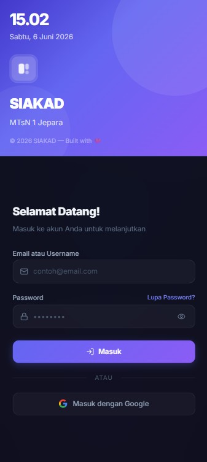

## 2. Dashboard Admin
1. Setelah berhasil masuk.
2. Anda akan di perlihatkan dashboard statistik realtime, mulai dari kelas yang berjalan, siswa yang tidak hadir. dan jadwal semua pelajaran di hari itu.
3. Klik tombol **Layah penuh**. Anda akan menampilkan dashboard statistik fullscreen yang cocok di tampilkan di layar TV / Monitor.

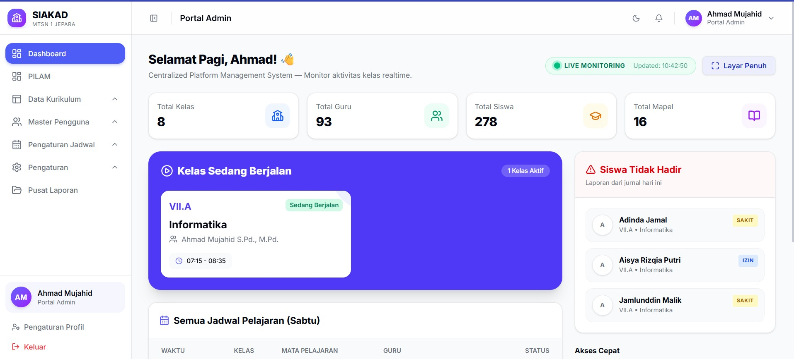

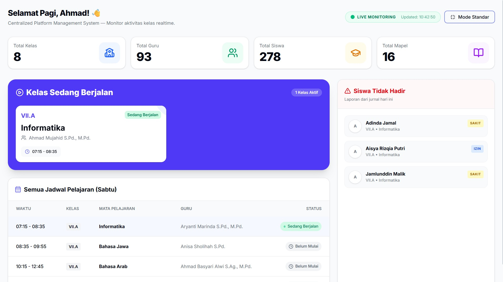

---

## 2. Pengaturan Master Data (Langkah Pertama)
Sebelum memasukkan data guru atau siswa, pastikan fondasi sekolah sudah diatur di menu **Master Data**. Kerjakan sesuai urutan berikut:

1. **Tahun Ajaran**: Buat tahun ajaran baru (misal: 2026/2027 Semester Ganjil). Jangan lupa **Aktifkan** tahun ajaran tersebut agar seluruh transaksi sistem masuk ke periode yang benar.
2. **Jurusan**: (Opsional jika sekolah Anda memiliki penjurusan/peminatan).
3. **Tingkat**: Buat tingkatan kelas (misal: Kelas X, XI, XII atau Kelas 7, 8, 9).
4. **Kelas**: Buat rombongan belajar (rombel) berdasarkan tingkat (misal: X MIPA 1, X IPS 2).
5. **Mata Pelajaran**: Masukkan seluruh daftar mata pelajaran yang diajarkan di sekolah beserta kelompoknya (Muatan Nasional, Kewilayahan, dll).

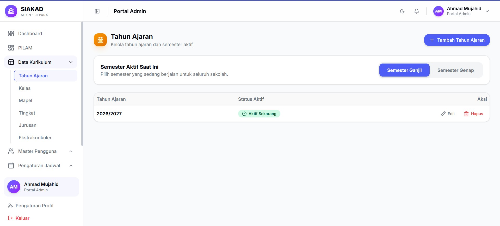

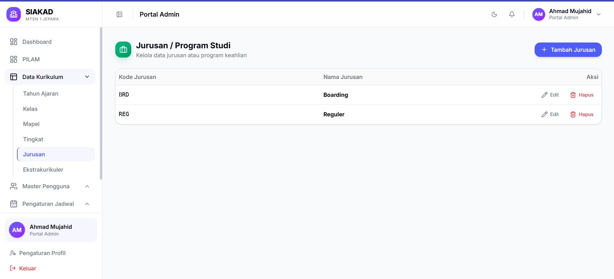

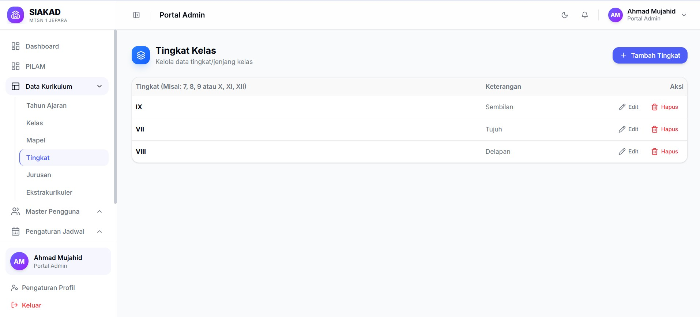

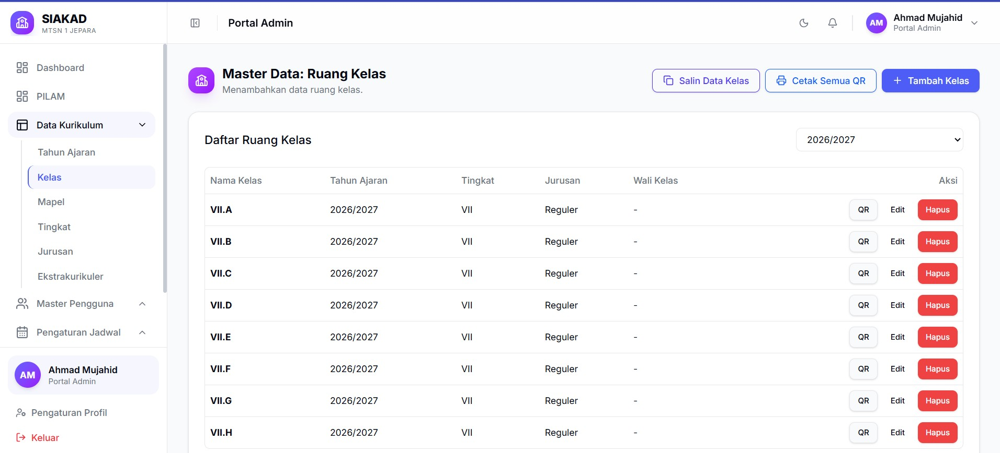

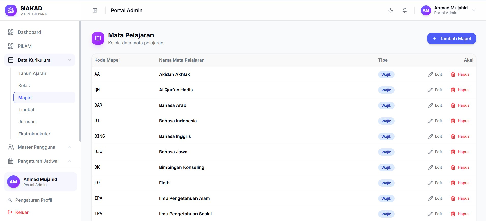

---

## 3. Manajemen Pengguna (User Management)
Setelah kerangka data siap, langkah selanjutnya adalah memasukkan data warga sekolah.
Anda bisa menginput data satu-per-satu atau **Import dari Excel**.

1. **Karyawan**: Masukkan data staf TU atau pegawai non-akademik lainnya.
2. **Guru**: Masukkan data tenaga pendidik. Pastikan alamat *email* benar agar guru bisa *login*.
3. **Siswa**: Masukkan data peserta didik baru atau sisipkan siswa pindahan. Pada saat menambah siswa, sistem akan meminta Anda menempatkan siswa tersebut ke **Kelas** yang sudah dibuat di tahap sebelumnya.

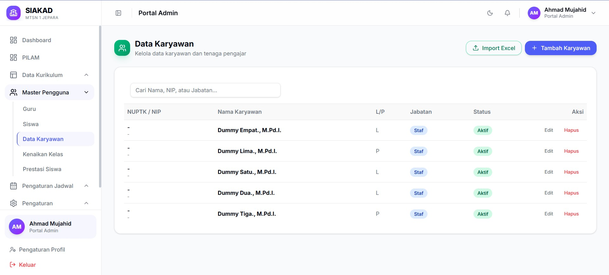

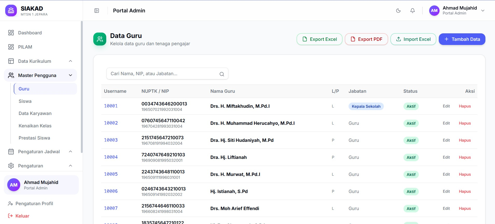

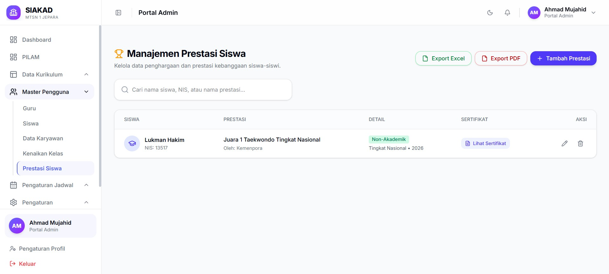

---

## 4. Setup Penugasan dan Jadwal (Krusial)
Tahap ini wajib diselesaikan sebelum KBM berjalan agar guru dapat melakukan absen dan menilai siswa.

1. **Penugasan Mengajar**: Buka menu ini untuk menghubungkan *Siapa mengajar Apa di mana*. Contoh: Pak Budi (Guru) ditugaskan mengajar Matematika (Mapel) di X MIPA 1 (Kelas).
2. **Sesi Waktu**: Masuk ke menu Jadwal > Sesi Waktu. Atur jam masuk dan jam pulang (Jam ke-1, Jam ke-2, Jam Istirahat, dll).
3. **Jadwal Pelajaran**: Susun jadwal mingguan. Tempatkan penugasan mengajar guru ke dalam blok-blok waktu dan hari yang telah tersedia.

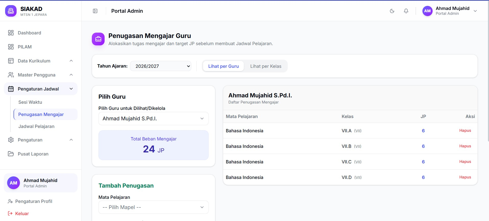

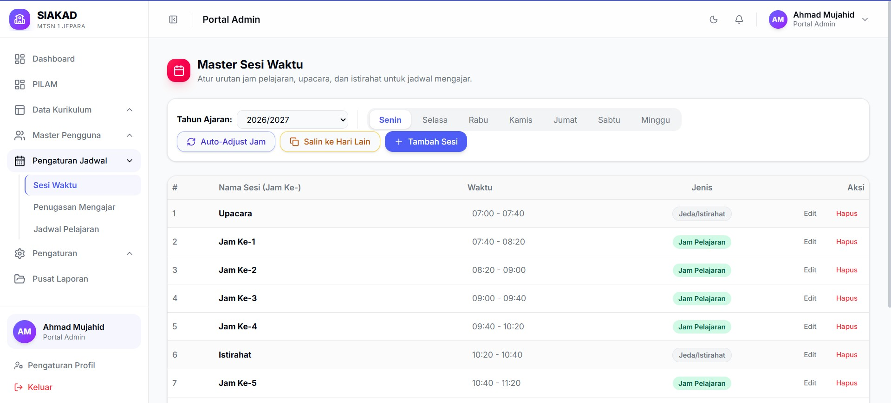

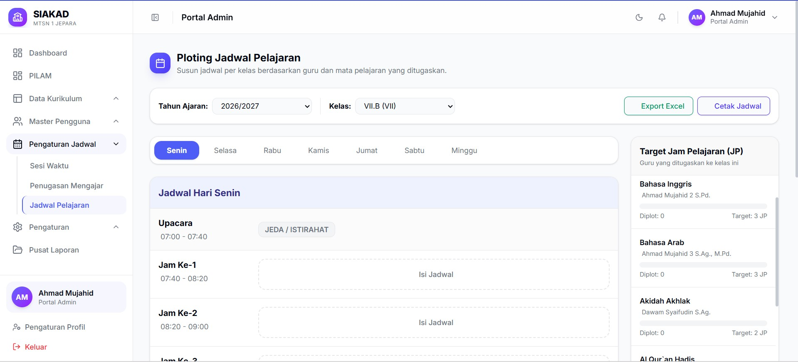

---

## 5. Ekstrakurikuler
1. Buka menu **Master data > Ekstrakurikuler**.
2. Daftarkan jenis ekstrakurikuler yang ada di sekolah beserta pembinanya.
3. Masuk ke **Manajemen Anggota** untuk memasukkan siswa-siswa ke dalam ekstrakurikuler pilihannya.

> 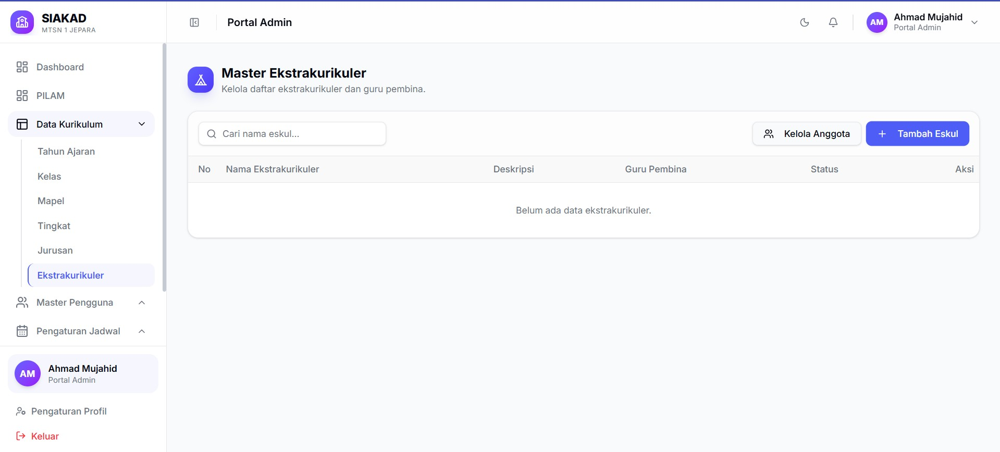

---

## 6. Operasional Berjalan (Fitur Harian)
Saat sekolah sudah berjalan, Administrator mengelola hal-hal insidental:

1. **Master Pengguna > Prestasi Siswa**: Masukkan catatan jika ada siswa yang memenangkan lomba selama di sekolah.

2. **Kenaikan & Pindah Kelas**: Pada akhir semester/tahun, gunakan menu ini untuk memindahkan siswa secara massal ke kelas yang lebih tinggi dan merubah status jadi alumni / lulus bagi kelas akhir..

---

## 7. Pusat Laporan (Reporting)
Pada akhir bulan atau saat pembagian rapot, Admin dapat mengunduh seluruh rekapan aktivitas sekolah.
Buka menu **Laporan**, Anda bisa mengunduh:
- Laporan Jurnal Kelas
- Laporan Jurnal Guru
- Rekap Presensi Siswa Global
- Rekap Nilai Siswa Global

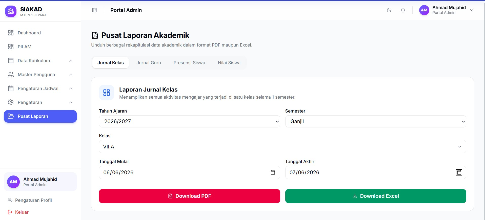

---

## 8. Pemeliharaan Sistem (Database)
Hanya gunakan menu **Database** jika Anda paham risikonya.
1. **Backup**: Mengunduh salinan database sebagai cadangan jika terjadi hal tak terduga. Lakukan ini secara berkala (misal sebulan sekali).
2. **Reset**: Fitur berbahaya. Gunakan hanya jika Anda ingin menghapus data tahun lalu untuk pergantian sistem secara total.

---
*Panduan ini adalah alur standar. Jika terdapat pertanyaan lebih spesifik, pastikan Anda merujuk pada standar operasional sekolah yang berlaku.*
