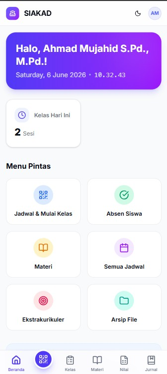
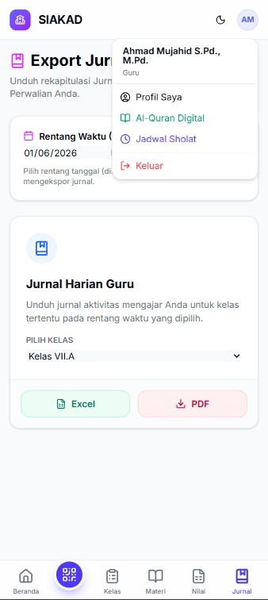
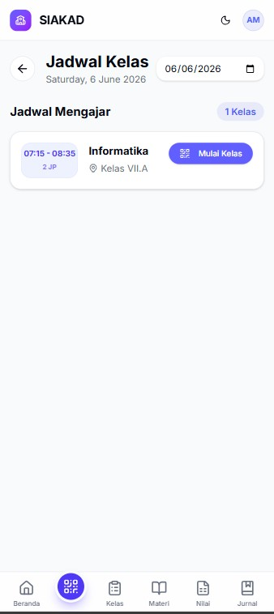
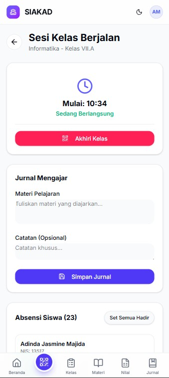
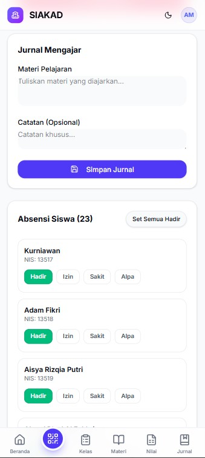
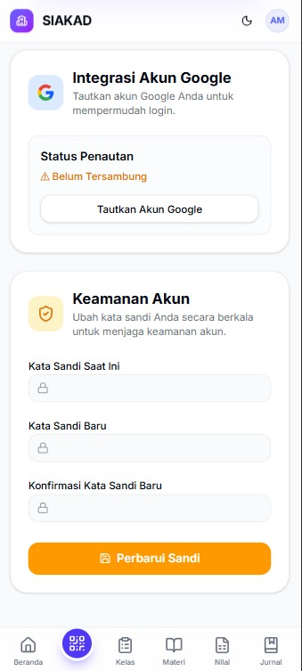
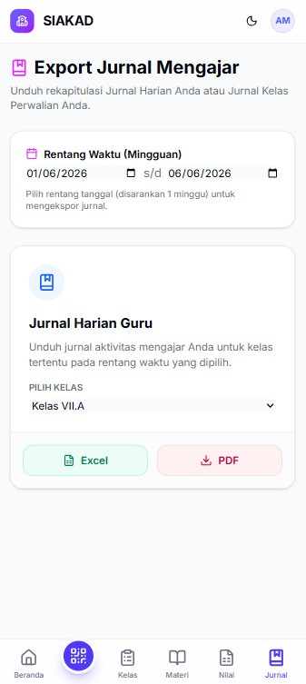
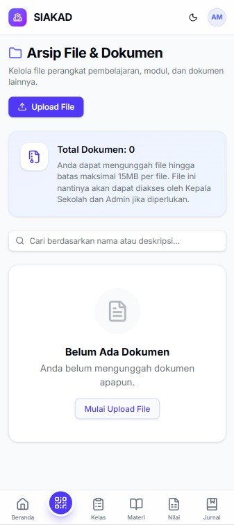

# Modul Penggunaan Aplikasi - Sisi Guru (Teacher)

Selamat datang di Sistem Informasi Akademik. Modul ini disusun untuk membantu Bapak/Ibu Guru dalam menggunakan berbagai fitur yang tersedia di dalam sistem.

## 1. Login ke Sistem
1. Buka halaman login aplikasi melalui browser.
2. Masukkan **Email/Username** dan **Password** yang telah didaftarkan oleh Administrator.
3. Klik tombol **Login**. Jika berhasil, Anda akan dialihkan ke halaman **Beranda (Dashboard) Guru**.

---

## 2. Beranda (Dashboard)
Halaman Beranda memberikan ringkasan singkat mengenai aktivitas Anda hari ini.
- **Kartu Informasi**: Menampilkan jumlah kelas yang Anda ajar hari ini dan jumlah tugas/jadwal sesi Anda.
- Dari halaman ini, Anda dapat menavigasikan diri Anda ke berbagai menu lainnya melalui *Sidebar* (menu samping) atau di menu bawah.

---

## 3. Fitur Keagamaan (Dropdown Profil)
Bapak/Ibu Guru dapat mengakses fitur pendukung keagamaan dengan menekan **Foto Profil** di pojok kanan atas layar.
1. **Al-Quran Digital**: Membaca Al-Quran 30 Juz lengkap dengan huruf Arab, latin, dan terjemahannya. Terdapat fitur pencarian surah.
2. **Jadwal Sholat**: Menampilkan jadwal waktu sholat hari ini yang disesuaikan dengan kota domisili (mendukung seluruh kota di Indonesia). Dilengkapi hitung mundur (*countdown*) ke waktu sholat berikutnya.

---

## 4. Menu Akademik
### A. Presensi (Kehadiran Siswa)
Digunakan untuk mencatat kehadiran siswa saat sesi belajar mengajar berlangsung.
1. Buka menu **Akademik > Presensi (tombol icon barcode)**.
2. Pilih Jadwal Mengajar/Kelas yang sedang berlangsung (scan barcode tinggal kebijakan sekolah).
3. Mengisi jurnal harian guru.
4. Tandai kehadiran masing-masing siswa (Hadir, Izin, Sakit, atau Alpa).
5. Klik **Simpan** untuk merekam data kehadiran ke sistem.

### B. Kelas (Rekap Absensi Siswa)
Digunakan untuk memantau hasil rekap absensi kelas, di semua kelas yang diampu.
1. Buka menu **Akademik > kelas**.
2. Pilih Mata Pelajaran dan Kelas yang ingin dinilai.
3. Anda Akan melihat rekap absensi, kehadiran siswa.
5. Anda juga bisa mengekspor data rekap ini.

> 

### C. Materi (Materi Pelajaran)
Digunakan untuk mengunggah materi bacaan, vidio, dan link web bacaan.
1. Buka menu **Akademik > materi**.
2. Pilih Mata Pelajaran dan Kelas yang ingin dinilai.
3. masukan komponen judul, keterangan, tipe materi, dan pilih file yang akan di unggah.
5. klik **Simpan** Sistem akan secara mengirim file materi ke semua siswa.

> 

### D. Penilaian (Nilai Siswa)
Digunakan untuk memasukkan nilai tugas, ulangan, atau ujian siswa.
1. Buka menu **Akademik > Nilai**.
2. Pilih Mata Pelajaran dan Kelas yang ingin dinilai.
3. Masukkan komponen nilai untuk setiap siswa pada kolom yang disediakan.
4. Klik **Simpan**. Sistem akan secara otomatis menghitung nilai akhir/rata-rata berdasarkan bobot yang telah dikonfigurasi.
5. Anda juga bisa mengekspor data nilai ini.

> 

### E. Jurnal
Sebagai buku catatan (log) aktivitas mengajar Bapak/Ibu.
1. Buka menu **Akademik > Jurnal**.
2. **Jurnal Guru**: Mencatat ringkasan materi apa saja yang Bapak/Ibu berikan pada hari/sesi tersebut.
3. **Jurnal Kelas**: Memantau catatan jurnal yang terjadi di suatu kelas secara keseluruhan (khusus Jika mengampu wali kelas).
4. Jurnal dapat diekspor/diunduh sebagai laporan.

> 

### F. Arsip
Digunakan untuk mengunggah semua berkas yang dibutuhkan, seperti RPP, modul ajar, silabus, dll.
1. Buka menu **Akademik > Arsip**.
2. Klik tombol **Upload FIle**.
3. Masukan komponen, pilihan tipe, pilihan file, judul dokumen, tahun.
4. Klik **Upload File** maka otomatis sistem akan menyimpan file anda di server.

> 

---

## 5. Fitur Wali Kelas (Khusus Wali Kelas)
Jika Bapak/Ibu ditugaskan sebagai Wali Kelas, menu tambahan ini akan muncul.
1. **Rekap Absensi Kelas**: Memantau persentase kehadiran seluruh siswa di kelas perwalian Bapak/Ibu selama satu semester. Bisa di-*export* ke PDF/Excel.
2. **Rekap Nilai Kelas**: Memantau rata-rata nilai setiap siswa dari seluruh mata pelajaran. Sangat berguna untuk bahan evaluasi saat pengambilan rapot.
3. Tampilan akan muncul jika guru juga mengampu sebagai wali kelas.

---

## 6. Keluar (Logout)
Pastikan Anda selalu keluar dari aplikasi jika menggunakan komputer/perangkat umum.
1. Klik **Foto Profil** di pojok kanan atas.
2. Pilih menu **Logout**.
3. Anda akan kembali ke halaman login.

---
*Apabila Bapak/Ibu mengalami kendala sistem, silakan hubungi bagian Tata Usaha atau Administrator sekolah.*
