# Modul Penggunaan Aplikasi - Sisi Siswa (Student)

Selamat datang di Sistem Informasi Akademik. Modul panduan ini disusun untuk membantu kamu (siswa) agar bisa mengecek jadwal, nilai, dan absensi melalui aplikasi ini.

## 1. Login ke Sistem
1. Buka halaman web aplikasi dari *smartphone* atau komputermu.
2. Masukkan **NIS/Username** dan **Password** yang diberikan oleh wali kelas atau admin sekolah.
3. Tekan tombol **Login**. Setelah berhasil, kamu akan masuk ke halaman utama (Dashboard).
4. Jika sudah menautkan alamat email di pengaturan profil bisa masuk dengan menekan tombol **Masuk dengan google**

---

## 2. Beranda (Dashboard)
Di halaman awal ini, kamu bisa melihat info kilat mengenai kegiatan belajarmu hari ini.
- Terdapat ringkasan tentang jadwal pelajaran yang sedang atau akan berlangsung.
- Ada kotak menu cepat (*quick access*) yang bisa kamu klik untuk langsung menuju ke halaman yang diinginkan.

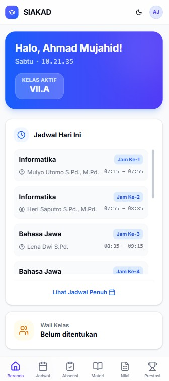

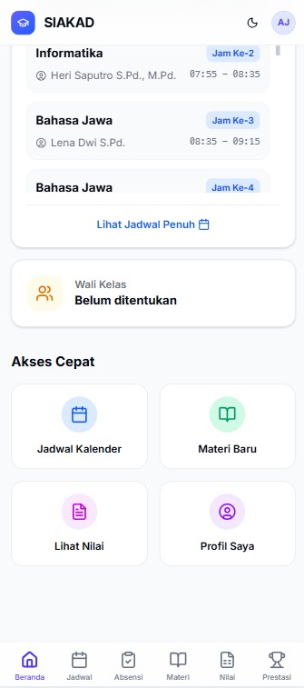

---

## 3. Fitur Keagamaan (Menu Profil)
Kamu bisa menggunakan fitur penunjang ibadah kapan pun kamu butuh. Caranya dengan mengeklik **Foto Profil** kamu di pojok kanan atas layar (atau menu dropdown profil di HP):
1. **Al-Quran Digital**: Fitur untuk membaca Al-Quran dengan tampilan bersih. Membantu kamu tadarus kapan saja. Terdapat 30 Juz lengkap dengan terjemahannya.
2. **Jadwal Sholat**: Menampilkan waktu sholat hari ini berdasarkan kota tempat kamu tinggal. Kamu juga bisa melihat waktu mundur (*countdown*) ke jam sholat selanjutnya, pastikan kamu tidak telat beribadah!

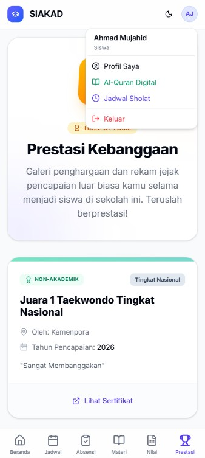

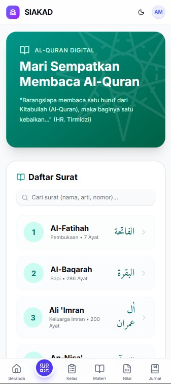

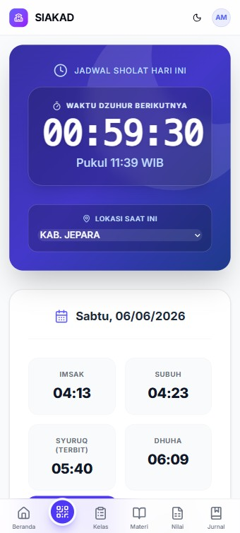

---

## 4. Info Akademik
Ini adalah menu-menu utama untuk mengecek kemajuan belajarmu. Kamu bisa menemukannya di menu navigasi samping (atau menu bar di bawah untuk HP).

### A. Jadwal Pelajaran
1. Buka menu **Akademik > Jadwal**.
2. Kamu akan melihat kalender/daftar mata pelajaran yang harus kamu ikuti setiap harinya.
3. Pastikan mengecek jadwal ini setiap malam agar tidak salah membawa buku esok harinya!

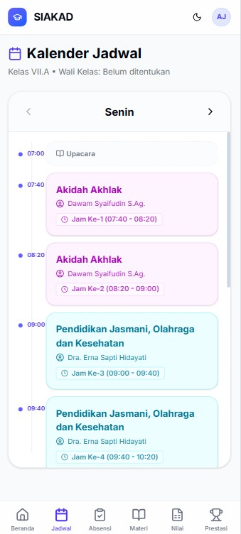

### B. Kehadiran (Absensi)
1. Buka menu **Akademik > Kehadiran**.
2. Kamu bisa memantau statistik kehadiranmu di kelas (jumlah Hadir, Izin, Sakit, atau Alpa).
3. Semakin penuh kehadiranmu, semakin baik prestasimu!

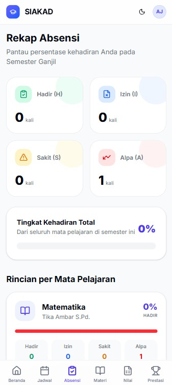

### C. Daftar Nilai
1. Buka menu **Akademik > Nilai**.
2. Di sini, hasil belajarmu dari tugas, kuis, dan ujian akan ditampilkan oleh guru.
3. Kamu bisa melihat rincian nilaimu per mata pelajaran. Gunakan info ini untuk mengetahui di pelajaran mana kamu perlu belajar lebih giat lagi.

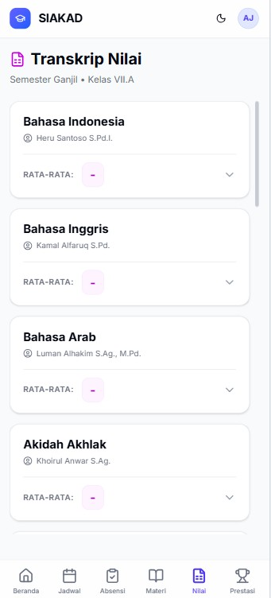

### D. Materi Pelajaran
1. Buka menu **Akademik > Materi**.
2. Kamu bisa melihat materi yang di berikan guru pengampu mata pelajaran.
3. Kamu bisa mengunduh dan mempelajari materi materi yang diberikan.

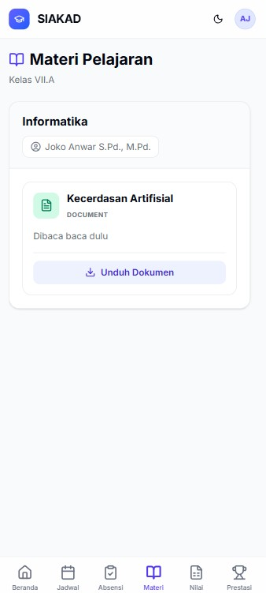

### E. Prestasi
1. Buka menu **Akademik > Prestasi**.
2. Kamu bisa melihat prestasi yang sudah kamu dapatkan selama ada di sekolah.
3. Kamu bisa mengunduh dan sertifikat atau foro yang di tampilkan.

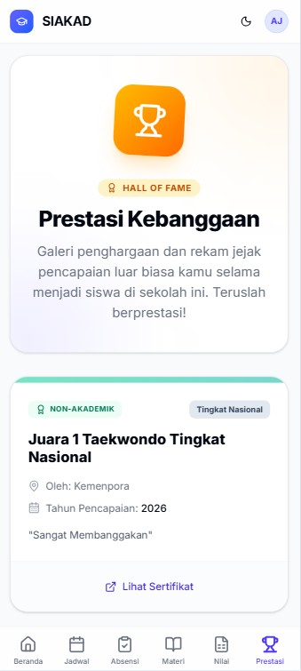

---

## 5. Pengaturan Profil
1. Klik **Foto Profil** di kanan atas, lalu pilih **Profil Siswa**.
2. Di sini kamu bisa melihat data dirimu. Jika ada kesalahan data (seperti nama atau alamat e-mail), segera laporkan ke Admin Tata Usaha untuk diperbaiki.
3. Kamu bisa menautkan emailmu untuk bisa masuk dengan menggunakan emailmu.

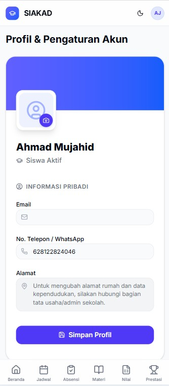

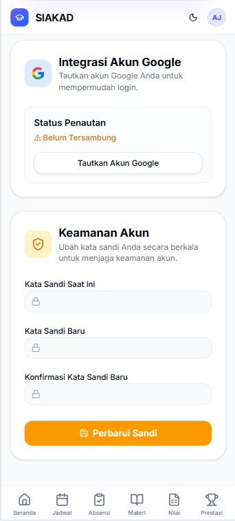

---

## 6. Keluar dari Aplikasi
Untuk menjaga keamanan akunmu agar tidak dipakai oleh orang lain, biasakan selalu melakukan *Logout*.
1. Klik **Foto Profil** kamu.
2. Pilih opsi **Logout**.

---
*Akan banyak modul informasi yang akan ada di halaman siswa, tunggu saja update selanjutnya*
*Semangat belajar dan raih cita-citamu! Jika kamu lupa password, tanyakan kepada Bapak/Ibu guru wali kelasmu atau admin.*
